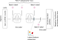

========
BAVARIA
========

BAVARIA is python package that implements a
Batch-adversarial Variational auto-encoder with Negative Multinomial reconstruction loss for single-cell ATAC-seq analysis.

In particular, the model can be used to extract a latent feature representation of
a cell which can be used for downstream analysis tasks, including cell cluster,
cell identification, etc.
The package is freely available under a GNU Lesser General Public License v3 or later (LGPLv3+)

Installation
============

::

    pip install https://github.com/BIMSBbioinfo/bavaria/archive/v0.1.0.zip

Documentation
=============

BAVARIA offers a command line interface that fits an ensemble of BAVARIA models
given a raw count matrix (-data)
Subsequently, the model parameters and latent features
are stored in the output directory (-output)

::

   bavaria -data adata.h5ad \
         -output <outputdir> \
         -epochs 200 \
         -nrepeats 10 \
         -nlatent 15 \
         -batchnames batch \
         -modelname bavaria
 
Additional information on available hyper-parameters are available through

::

  bavaria -h

Tutorial
========

Tutorials are available here:

+----------------------------------------------------+
| Example notebooks                                  |
+====================================================+
| `Data preparation PBMC integration`_               |
+----------------------------------------------------+
| `Using BAVARIA to integrate PBMC data`_            |
+----------------------------------------------------+

.. _`Data preparation PBMC integration`: https://nbviewer.jupyter.org/github/BIMSBbioinfo/bavaria/blob/master/tutorial/00_preparation.ipynb
.. _`Using BAVARIA to integrate PBMC data`: https://nbviewer.jupyter.org/github/BIMSBbioinfo/bavaria/blob/master/tutorial/01_pbmc_integration.ipynb

